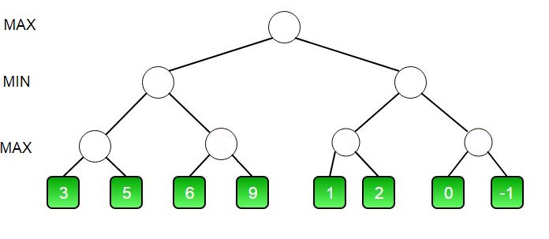
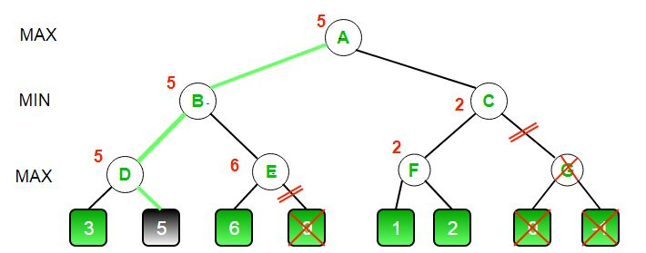
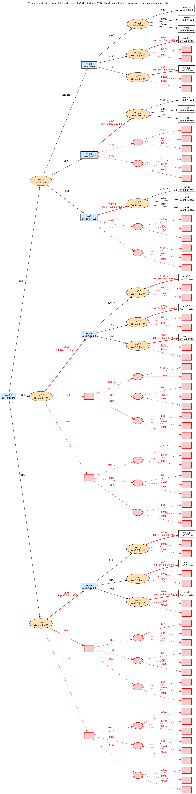

# Alpha Xiangqi — a Xiangqi (Chinese Chess) Engine

Alpha Xiangqi is a Xiangqi (Chinese Chess) engine written in Python. The "alpha"
is for alpha-beta: it selects
moves with iterative-deepening alpha-beta search and a material evaluation
adapted from Claude Shannon's 1950 paper *"Programming a Computer for Playing
Chess."* It communicates over the UCI protocol, so it can be used with Xiangqi
GUIs and tournament harnesses and can play against other engines.

It was built to compete in a tournament against other engines, where each move must be made within one second. The main design goal
was therefore to get as much search depth as possible within that time budget
while never losing on the clock.

## Features

- Iterative-deepening alpha-beta minimax that keeps the best move from the last
  depth that fully completes.
- Time management with a soft and hard deadline, so the search adapts its depth to
  the position and the machine and does not forfeit on timeout.
- Material evaluation in the style of Shannon's paper.
- Move ordering using MVV-LVA for captures and an advancement heuristic for quiet
  moves, followed by a top-N pruning step.
- A small opening book and randomized tie-breaking between equally good moves.
- Capture detection and history handling that avoid redundant engine calls in the
  search loop.

## How It Works

### Board representation

Positions are handled with [`pyffish`](https://pypi.org/project/pyffish/) (the
Fairy-Stockfish bindings) as FEN strings. Uppercase letters are Red, which moves
first; lowercase are Black. Files run `a`-`i` and ranks `1`-`10`. Piece letters
are `r` chariot, `n` horse, `c` cannon, `a` advisor, `b` elephant, `k` general,
`p` soldier.

### Evaluation

The board is scored on material alone, from Red's perspective (positive means good
for Red), using a value table adapted from Shannon's to Xiangqi's pieces:

| Piece | Chariot | Cannon | Horse | Advisor | Elephant | Soldier |
|-------|:-------:|:------:|:-----:|:-------:|:--------:|:-------:|
| Value |   9.0   |  4.5   |  4.0  |   2.0   |   2.0    |   1.0   |

The general is left out of the sum. It is never captured, so its count always
cancels; checkmate is handled by the search rather than by an artificial king
value.



### Search

Move selection is minimax with alpha-beta pruning inside an iterative-deepening
loop. Searching shallow-to-deep is cheap, since cost is dominated by the deepest
pass, and it means there is always a complete move available from the deepest
depth that finished.



### Time management

The engine reads the per-move budget from the UCI `go movetime` command and runs
the deepening loop against two limits:

- A hard deadline at 90% of the budget, checked inside every search node. Passing
  it raises a `SearchTimeout` that abandons the unfinished depth and falls back to
  the previous one.
- A soft stop at 50% of the budget, which prevents starting a depth that almost
  certainly cannot finish.

Together these mean the engine does not forfeit, always returns a legal move, and
searches as deep as the clock allows.

### Move ordering and pruning

Move ordering improves alpha-beta pruning, so before searching a node the moves
are scored from a single board parse, with no engine calls:

1. Captures are ranked first, ordered by MVV-LVA (Most Valuable Victim, Least
   Valuable Attacker), so capturing a chariot is tried before capturing a soldier.
2. Quiet moves are ranked by how far they advance toward the opponent.
3. Only the top N moves (default 10) are kept, which bounds the branching factor
   so the search reaches a useful depth. Captures are never dropped by this cut.

A shuffle before a stable sort means equally scored moves are still broken
randomly. This avoids the repetitive back-and-forth shuffling that a
material-only engine is otherwise prone to.

### Visualizing the search

Running `python alpha_xiangqi.py draw` renders the engine's own search to an image:
a top-3, depth-4 minimax tree from a fixed opening, with every node labelled by
its backpropagated value and the α/β window it was searched with.



Boxes are MAX nodes (Red), ellipses are MIN nodes (Black), and white nodes are
leaves scored by the evaluator. Red dashed edges are the branches alpha-beta
prunes; a bold red edge labelled `β ≤ α` is the move that triggered the cut-off.

### Performance optimizations

- Captures are detected by checking whether a move's destination square is
  occupied, read directly off the FEN, instead of calling the engine once per
  move.
- The game history is folded into a single FEN once per move, so the search does
  not replay all prior moves on every internal call.
- The evaluator reads the FEN it already holds rather than rebuilding it.

## Performance

Informal measurements (opening position, one-second budget, on the development
machine) show how the optimizations added up to real search depth:

| Engine version                                 | Depth reached in 1 s |
|------------------------------------------------|:--------------------:|
| Full-width search, engine-based capture checks |          1           |
| With top-N move cap                            |          2           |
| With board-based capture detection             |          3           |
| With history collapsing and MVV-LVA ordering   |      3 (faster)      |

Per-depth search time from the opening (44 legal moves) with the final version:

| Depth | Time   |
|:-----:|:------:|
|   1   | 0.03 s |
|   2   | 0.08 s |
|   3   | 0.39 s |
|   4   | 1.18 s |

In practice the engine completes depth 3 within a one-second budget in both
opening and middlegame positions, up from the one-ply greedy play it started with.

## Getting Started

### Requirements

- Python 3.10+
- [`pyffish`](https://pypi.org/project/pyffish/)

### Install

```bash
python -m venv venv
source venv/bin/activate          # on Windows: venv\Scripts\activate
pip install pyffish
```

## Usage

### Play it as a UCI engine

`alpha_xiangqi.py` communicates over standard input and output using UCI. A minimal
exchange:

```
$ python alpha_xiangqi.py
uci
id name Alpha Xiangqi
id author Jinghan Chen
uciok
position startpos moves h3e3 h8e8
go movetime 1000
bestmove b3b10
```

Point a UCI-compatible Xiangqi GUI at `alpha_xiangqi.py` to play against it.

### Run a tournament

`tournament.py` plays engines against each other in a round-robin and prints PGN
game records and a results table:

```bash
python tournament.py
```

### Visualize the search tree

```bash
python alpha_xiangqi.py draw
```

This writes `minimax_tree.png` (and `minimax_tree.dot`) for the figure above. It
needs the graphviz `dot` binary on your `PATH`; without it the `.dot` file is
still written for manual rendering.

## Project Structure

```
alpha_xiangqi.py  The engine: evaluation, search, time management, move ordering
tree_draw.py      Renders the minimax/alpha-beta search tree (python alpha_xiangqi.py draw)
tournament.py     Round-robin harness that plays UCI bots against each other
random_bot.py     Baseline opponent that plays random legal moves
tactician.py      Baseline opponent that grabs immediate checkmates
analyzer.py       Helper utilities for inspecting games
sample_game.txt   An example recorded game
```

## Possible Improvements

- Positional evaluation terms (piece-square tables, mobility, king safety) to
  convert a material lead into checkmate instead of shuffling.
- Principal-variation move ordering, searching the previous iteration's best move
  first to prune harder and reach another ply.
- A transposition table to avoid re-searching positions reached by different move
  orders.


---

This project was developed as coursework for CS5100: Foundations of Artificial Intelligence.
