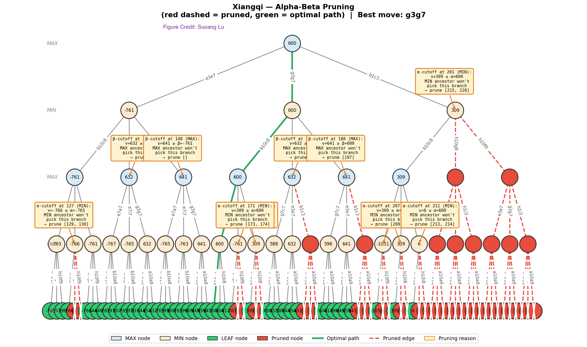

[](https://classroom.github.com/open-in-codespaces?assignment_repo_id=23827060)
# Homework - Adversarial Search 👑🛡️🐘🐴💣♟️♖

Topics: Minimax and AlphaBeta

For this assignment you will be making your own xiangqibot taking advantage of the search techniques discussed in class. You do not need to program the rules of xiangqi in order to complete this assignment.

---

## Part 0 - Pre-req

There are some libraries and other software that you will need.

### Needed Python Packages

* Fairy-Stockfish -  Install with the command `pip install pyffish`.
* pyinstaller - [pyinstaller.org/](https://pyinstaller.org/) for converting your .py files into .exe executables. Install with the command `pip install pyinstaller`. This is only if you are running Windows and not using something like CodeSpaces. If on Linux/Mac you can use `chmod +x` to make your life easier.

### Engines and Tournaments

To create your executable agent use the command `pyinstaller --onefile random_bot.py` except replace with your agent file. This will create an executable, like `random_bot.exe`, inside of a new directory called `dist`. For simplicity, move this file to the directory with the tournament code. **If you are on Mac/Linux**, there is another way to make this program executable by using `chmod +x random_bot.py` in the terminal, but pyinstaller should work as well.

In order to test/analyze your agent, you'll need to download a Fiary-Stockfish executable (not just the pip install). You can find downloads for your platform here: [https://fairy-stockfish.github.io/download/](https://fairy-stockfish.github.io/download/). If you are on mac, use Brew to install [https://formulae.brew.sh/formula/fairy-stockfish](https://formulae.brew.sh/formula/fairy-stockfish).


**Important**: Update [analyzer.py](analyzer.py) to use your downloaded executable. It is best to make sure it is in this same directory. Then try executing `analyzer.py` using the command `python analyzer.py` and paste in the sample game provided in [sample_game.txt](sample_game.txt). It will then create an analysis of moves as well as images. If you then run the provided server with `python server.py` it will create a website which well let you analyze the game.

The website [https://play.xiangqi.com/analysis/board](https://play.xiangqi.com/analysis/board) can be a useful resource.

### Xiangqi Rules

Being a strong Xiangqi is not needed to program a bot that plays it. A great primer can be found here: [https://www.youtube.com/watch?v=kqcwVrE3C5Q](https://www.youtube.com/watch?v=kqcwVrE3C5Q)

In xiangqi FEN notation:

#### Piece Letters (Case-sensitive)
- **K / k** = King (General/將/帥)
- **A / a** = Advisor (Advisor/士/仕)
- **B / b** = Bishop (Elephant/相/象)
- **R / r** = Rook (Chariot/車/俥)
- **C / c** = Cannon (Cannon/炮/砲)
- **N / n** = Knight (Horse/馬/傌)
- **P / p** = Pawn (Soldier/兵/卒)

#### Case Convention
- **Uppercase letters (KABRCNP)** = Red/White pieces
- **Lowercase letters (kabrcnp)** = Black pieces

#### Example Starting Position FEN
```
rnbakabnr/9/1c5c1/p1p1p1p1p/9/9/P1P1P1P1P/1C5C1/9/RNBAKABNR w - - 0 1
```

#### FEN Structure
A xiangqi FEN has six fields (similar to chess):
1. **Piece placement** - Starting from rank 10 (top) to rank 1 (bottom), files a-i from left to right. Ranks separated by `/`, empty points indicated by digits 1-9
2. **Active color** - `w` (red/white to move) or `b` (black to move)
3. **Castling** - Not used in xiangqi, typically `-`
4. **En passant** - Not used in xiangqi, typically `-`
5. **Halfmove clock** - Number of halfmoves since last pawn advance or capture
6. **Fullmove number** - Starts at 1, incremented after Black's move

#### Key Differences from Chess FEN
- The board is 9×10 (90 points) instead of 8×8
- No castling or en passant in xiangqi

**Important** The library we are using does not have a lot of useful functions for getting piece counts, but, it does have the ability to get the FEN using the `get_fen()` function. From there you should be able to count the number of each piece (as well as their colors) on the board. You can also determine whose turn it is by looking to see if very last letter is `b` or `w`.

## Part 1 - Instructions

This assignment is meant to ensure that you:

* Understand the concepts of adversarial search
* Can program an agent to traverse a graph along edges
* Experience developing different pruning algorithms
* Apply the basics of Game Theory
* Can argue for chosing one algorithm over another in different contexts

You are tasked with:

0. Copy [random_bot.py](random_xiangqi_bot.py) and update it to develop a new brand new and intelligent xiangqibot with a unique & non-boring name. ***Do not name it `my_xiangqi_bot`, `your name`, or something similar.*** If you do, you will ***automatically earn a zero*** for this assignment. Come up with something creative, humourous, witty, adventuous, -- or something will strike fear into the hearts of the other xiangqibots in this competition.

1. Develop a strong evaluation function for a board state. Take a look at "Programming a Computer for Playing Chess" by Claude Shannon [https://www.computerhistory.org/xiangqi/doc-431614f453dde/](https://www.computerhistory.org/xiangqi/doc-431614f453dde/) published in 1950. You will specifically want to take a look at section 3 in which Shannon describes a straight-forward evaluation function that you can simplify to only evaluate material (pieces) to score a board state.

  * **Note** that your evaluation function will play a crucial role in the strength of your xiangqibot. It is ok to start with a simple function to get going, but you will need to find ways to improve it because your bot will be competing with the bots from the rest of the class and extra points are on the line.
  * Talk to the teaching team for helpful tips if you are really stuck.
  
2. Alter your xiangqibot so that when you run the program, it creates a Minimax game tree that:

* Starts with the root as a known opening sequence. This is because from the very begining of the game, you do not have that many options and it is difficult to judge how your bot is thinking. You can find a good set of opening moves here [https://www.xiangqi.com/articles/glossary-of-basic-xiangqi-chinese-chess-opening-systems](https://www.xiangqi.com/articles/glossary-of-basic-xiangqi-chinese-chess-opening-systems).

* Perform the Minimax algorithm on the tree, backpropogating each node with the correct minimax value.
* Identify the final value of the game tree and the move that your bot will select in a title or subtitle.
* Perform Alpha-Beta pruning on this game tree
* If no branches were pruned, change your opening and/or your evaluation function so that there is some demonstrable pruning (if you don't do the visualization extra credit, you will likely need some message to the console to indicate pruning has occured).

3. At any given point in a xiangqi game there are roughly 20 possible moves. Your Minimax and Alpha-Beta Pruning algorithms will spend a lot of time on what are clearly poor moves. You are allowed alter these algorithms slightly to not even consider poor quality moves or to only look at the top 7 to 10 moves at a time.
4. When you are done, answer the questions in the reflection and complete the last two sections.

**All code for this portion should be written yourself.** Note that it may be easier to follow the search if you create a visualization for it. Given the workload for that, the visualization is optional and extra credit (see [this section](#extra-credit)).


### Optimization
Given there is a 1-second response time limit per move, you may find a need to optimize your search beyond what's possible with built-in functions. For this portion, you may use LLMs to optimize your search. **Clearly document and cite where you have included LLM generated code.**

### Documentation

Ensure that your xiangqibot follows normal PyDoc specs for documentation and readability. 

### Extra Credit
(1 point.) Create a visualization of the game tree that is being searched. **You can use generative AI for this portion only.**

Your visualization may look like this: 

The steps are: 
* Alter your xiangqibot so that when called with the command line parameter `draw` (such as `python random_bot.py draw`) it creates a Minimax visualization that starts with the root as a known opening sequence.
* Perform the Minimax algorithm on the tree, labeling each node backpropogating with the correct minimax value.
* Have your graph select the top three moves per node and label each edge with the move's notation.
* Limit the depth of the generated tree visuals to four (4) half-moves ahead (R-B-R-B). This is because the visuals will be too difficult to read otherwise.
* Label the leaf nodes with the result of that board state's evaluation.
* Alpha-beta pruning should re-color edges and subtrees that have been pruned.
* Finally, draw on the image (use a tablet or print and mark on it) with the results of alpha and beta for each node -- clearly identifying the why & how your graph pruned these edges that it pruned.

**Clearly document and cite where you have included LLM generated code.**

## LLM Policy

You CAN use LLMs to generate code for the visualization extra credit. 

You CAN use LLMs to ask conceptual questions about topics, explain error messages, and refactor your code AFTER it has been written.

You CAN use LLMs to generate search optimization after you have written your initial alpha-beta pruning program.

You CANNOT use LLMs to generate the code for the rest of your homework assignment.

Clearly document your usage in your code and in the Readme.md in the section below.
Include in your submission:

* What you used AI for (e.g., "refactoring nested conditionals," "generating unit tests," "learning Strategy pattern")
* Example prompts showing how you used AI

## Part 2 - Reflection

Update the README to answer the following questions:

1. Describe your experiences implementing these algorithms. What things did you learn? What aspects were a challenge?
2. These algorithms assumed that you could reach the leaves of the tree and then reverse your way through it to "solve" the game. In our game (xiangqi) that was not feasible. How effective do you feel that the depth limited search with an evaluation function was in selecting good moves? If you play xiangqi, would you be able to beat your bot? If so, why do you think so? If not, what made the bot so strong - the function or the search?
3. Shannon wrote "... it is possible for the machine to play legal chess, merely making a randomly chosen legal move at each turn to move. The level of play with such a strategy is unbelievably bad. The writer played a few games against this random strategy and was able to checkmate generally in four or five moves (by fool's mate, etc.)" How did your xiangqibot do against the random bot in your tests?
4. Explain the what would happen against an opponent who tries to maximize their own utility instead of minimizing yours.
5. What is the "horizon" and how is it used in adversarial tree search?
6. (Optional - Not Graded) What did you think of this homework? Challenging? Difficult? Fun? Worth-while? Useful? Etc.?

---

### (Extra Credit) Your Images Here

Add the images that you created from the forced opening that you chose so that it demonstrates AlphaBeta Pruning.

### Your Evaluation Function Here

Conciesly and effictively describe the evaluation function that you used for your xiangqibot. You can also use Latex as long as you explain the symbols and justify why you created your function in the manner with which you did.

$$f(X,n) = X_n + X_{n-1}$$

### Your LLM Disclosure

When disclosing your use of LLMs in this assignment, provide the following: (1) Which AI tool you used and for what specific purpose, (2) The actual prompts you entered (if any). Including your prompts demonstrates transparency and helps others understand your approach, (3) What you kept, modified, or rejected from the AI's responses, and (4) How the AI assistance influenced your final work. Be specific and honest in your disclosure. Note, if using copilot or other LLM for autocomplete, you don't have to disclose all auto complete, but you should disclose how it was evaluated in addition to what extent it was used.
